# Automutiny Agents

**Lean, battle-tested AI agents that save hours and protect revenue without endlessly increasing token costs.**

These agents have been deployed in real business workflows. The business data shown here has been anonymized to protect client privacy.

Each agent owns one operational job. It applies written business rules, calls a model only where judgment helps, validates the result, saves an inspectable trace, and stops for human review before any consequential action.

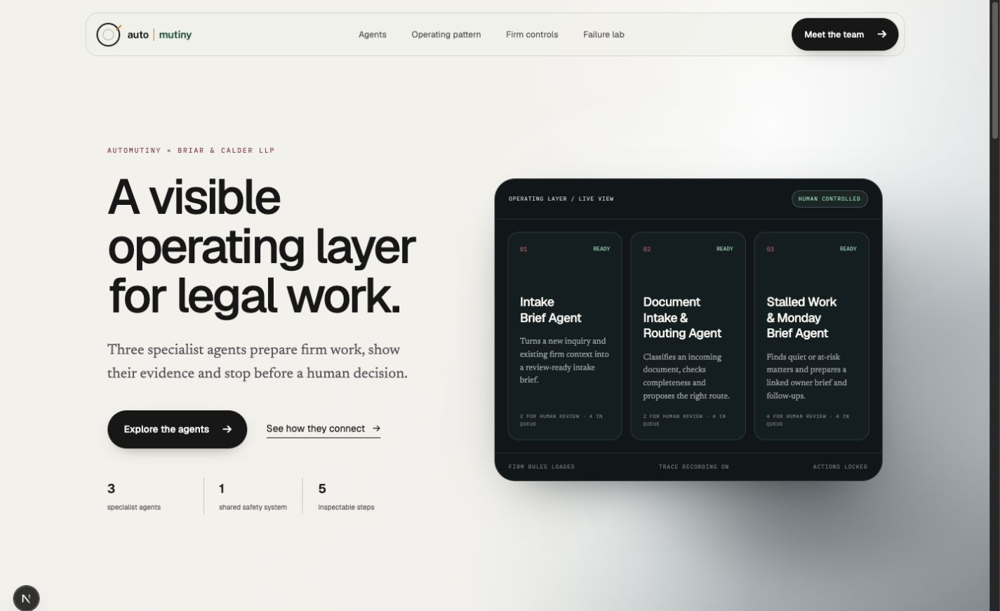

## The agents

| Vertical | Agent | What it prepares | What stays human |
|---|---|---|---|
| Legal services | Intake Brief | Qualification score, missing facts, risk flags, and reply draft | Conflict checks, legal assessment, client communication, and accepting work |
| Legal services | Document Intake and Routing | Document classification, completeness check, and routing proposal | Authenticity, sufficiency, final routing, and client requests |
| Legal services | Stalled Work and Monday Brief | Ranked stalled matters, owner notes, and next-step suggestions | Calls, escalation, deadline strategy, reassignment, and closure |

## How it works

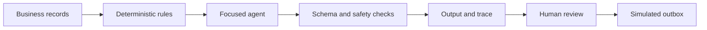

The public code keeps outbound actions simulated. Agent modules cannot send email, make legal decisions, or change external systems. A person must approve, edit, reject, dismiss, or snooze the prepared work.

The system stays lean by using deterministic checks before model calls, bounded inputs and outputs, structured schemas, shared runtime controls, and a trace for every run.

## Agent workflows

<details>
<summary><strong>Intake Brief:</strong> inquiry to review-ready brief</summary>

### Start and queue

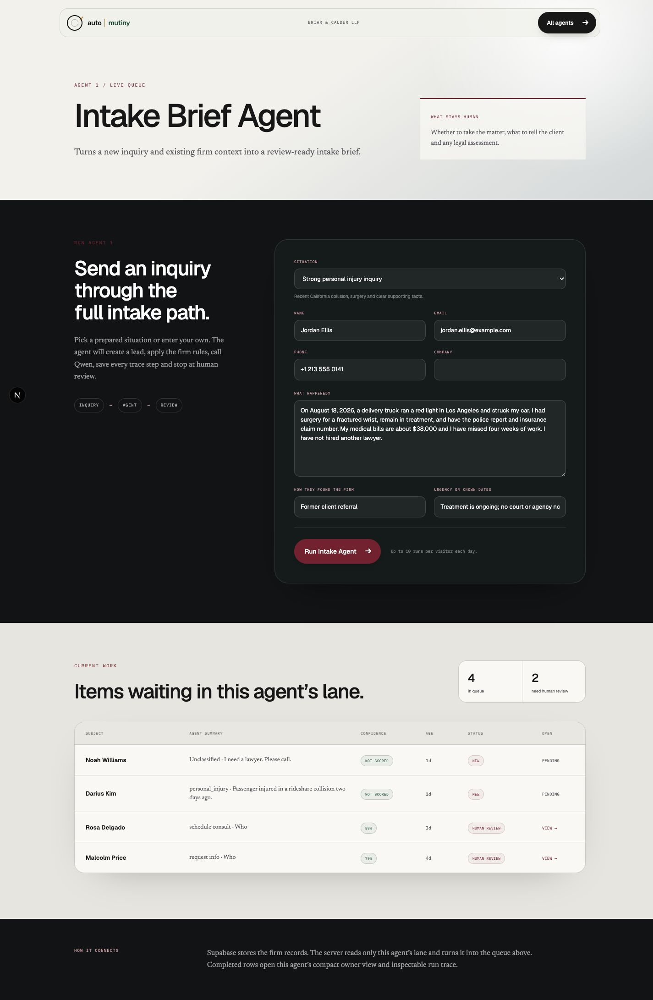

### Human review

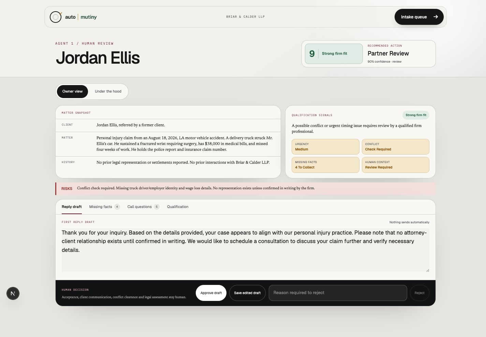

### Run trace

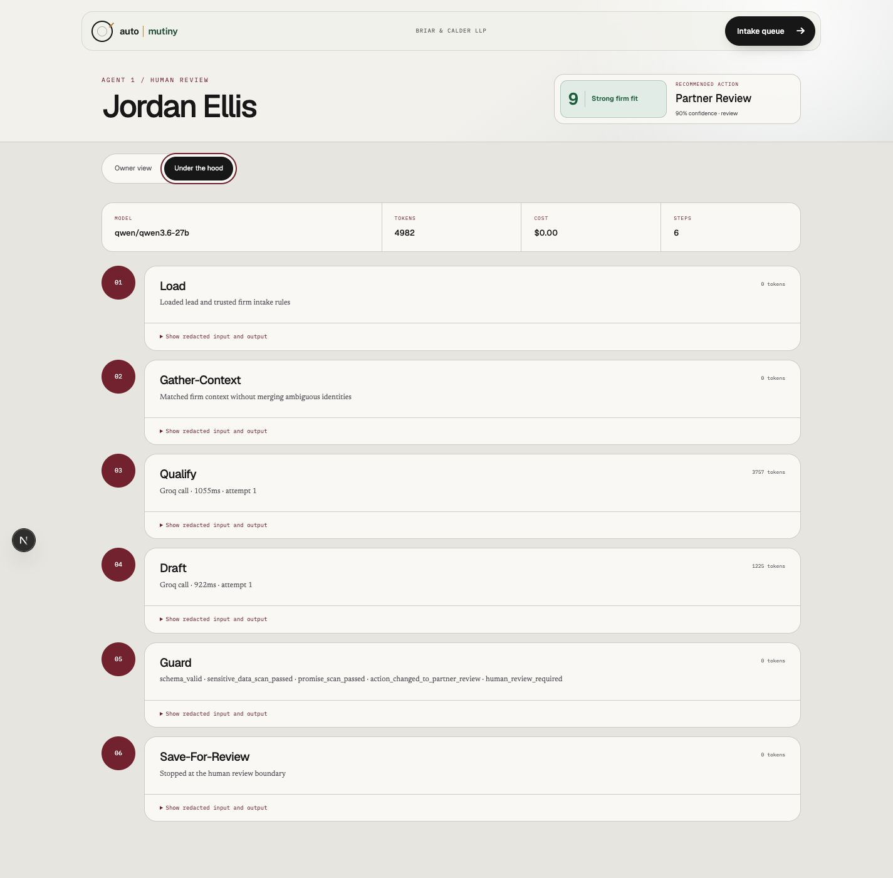

</details>

<details>
<summary><strong>Document Intake and Routing:</strong> PDF to reviewed routing decision</summary>

### Start and queue

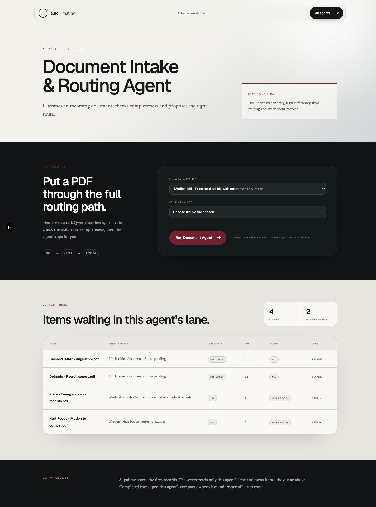

### Human review

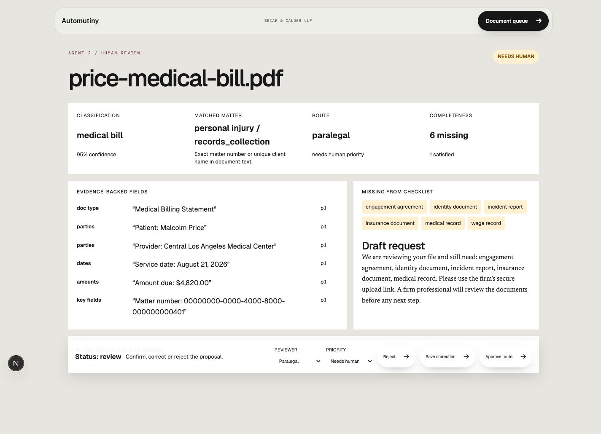

### Run trace

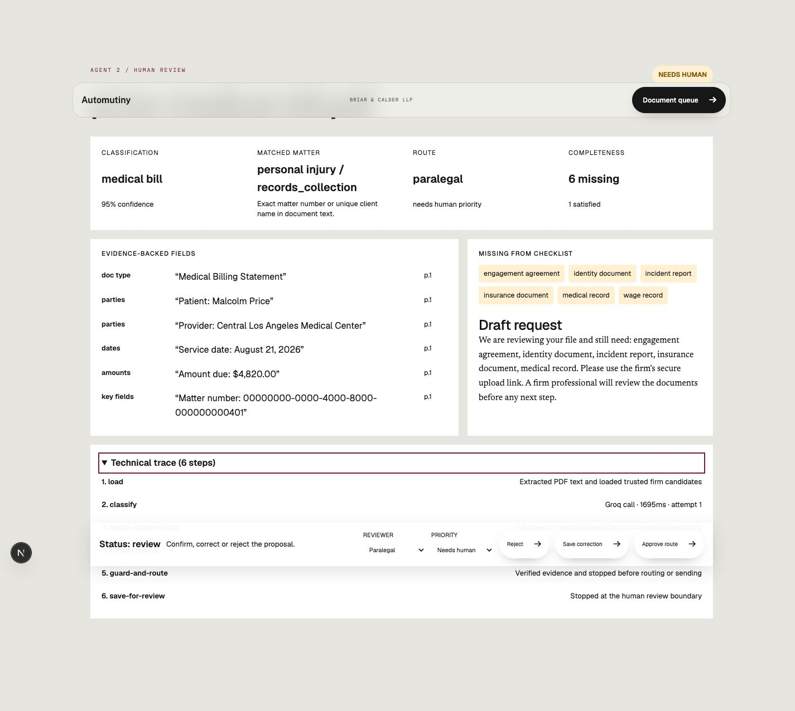

</details>

<details>
<summary><strong>Stalled Work and Monday Brief:</strong> matter scan to owner decision</summary>

### Scan and queue

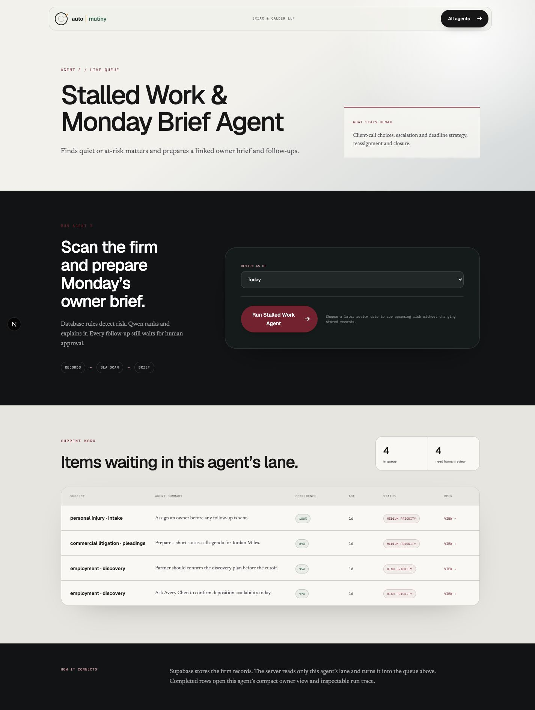

### Owner review

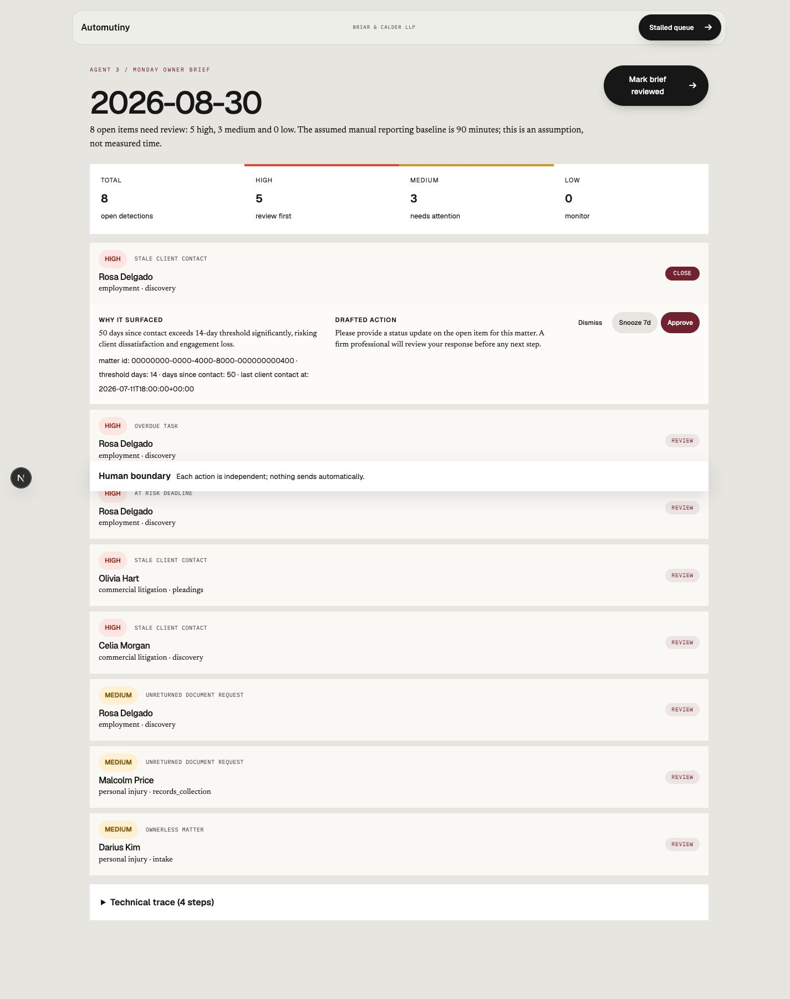

### Run trace

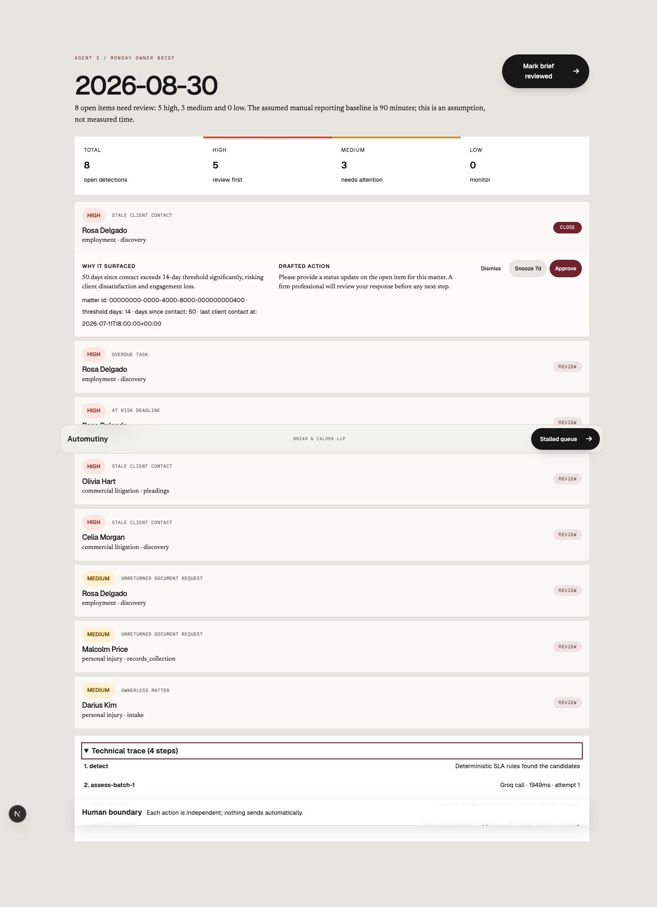

</details>

The galleries are collapsed so the README stays compact while the full workflow remains available.

## Repository map

| Folder | Responsibility |
|---|---|
| `packages/agents/intake-brief` | Intake rules, prompts, schemas, UI, tests, and eval cases |
| `packages/agents/document-routing` | Document rules, fixtures, schemas, UI, tests, and eval cases |
| `packages/agents/stalled-work` | Stalled-work rules, schemas, UI, tests, and eval cases |
| `packages/agents/shared-runtime` | Model calls, limits, guards, retries, and tracing |
| `apps/web` | Next.js routes and dashboard |
| `supabase/migrations` | Versioned database schema and security policies |
| `deployment/client` | Self-hosting setup and verification |

## Run it yourself

The source code is free to use and self-host under the [MIT License](./LICENSE). You provide your own Supabase project, Groq API key, and hosting account. Provider free tiers may be enough for evaluation, but their limits and availability can change.

Requirements:

- Node.js 22 or newer
- pnpm 10.34
- A Supabase project
- A Groq API key, unless using the deterministic mock provider

Use the existing setup workflow:

```bash
pnpm install --frozen-lockfile
cp apps/web/.env.example apps/web/.env.local
deployment/client/setup-client.sh
pnpm exec supabase login
pnpm exec supabase link --project-ref YOUR_PROJECT_REF
pnpm exec supabase db push
pnpm seed
deployment/client/verify-client.sh
pnpm dev
```

Open `http://localhost:3000`, then follow the [self-hosting guide](./deployment/client/README.md) for Vercel deployment and production checks.

No credential belongs in source control. Keep `apps/web/.env.local` private and use separate Supabase, Groq, and hosting credentials for each installation.

## Verification evidence

The committed release gate covers 60 intake cases, 60 document cases, 6 stalled-work snapshots, 45 pressure cases, and 40 red-team cases. [`docs/evals/live-model.md`](./docs/evals/live-model.md) records the separate Groq connectivity and schema check.

These checks verify deterministic contracts and safe failure behavior. They do not claim universal model accuracy.

Focused checks:

```bash
pnpm lint
pnpm typecheck
pnpm test
```

Major release checkpoint:

```bash
pnpm release:check
pnpm lint
pnpm typecheck
pnpm test
pnpm build
```

See [`SPEC.md`](./SPEC.md) for the system specification, [`docs/SECURITY.md`](./docs/SECURITY.md) for the security boundary, and [`docs/adr`](./docs/adr) for the main design decisions.
